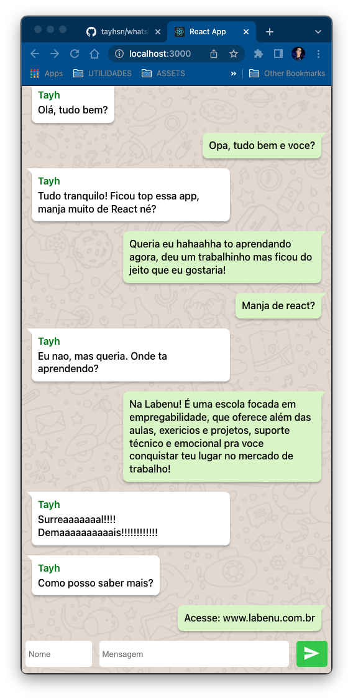

# Whatslab

Aplicação que simula a troca de mensagens entre usuários.

## Sobre

Primeiro projeto de fixação do módulo de React.js da [Labenu](https://www.labenu.com.br/).

[Deploy do App](https://whatslab.vercel.app/)

## Implementação

O projeto possui as seguintes funcionalidades:

-  Ao enviar a mensagem com o nome de usuário 'Eu' a posiçao da mensagem é invertida, similar a plataforma whatsapp;
-  Envio com a tecla 'Enter' no input da mensagem e no botão, além do click;
-  Deletar a mensagem com 2 clicks sobre a mesma;
-  A mensagem só é enviada se possuir remetente e mensagem.

## Futuras implementações:

-  Toggles flutuantes de aviso sobre as funcionalidades de envio e deleção.
-  Scroll para visualizar as mensagens mais antigas.
-  Expandir input para visualizar mensagens muito longas.

## Bibliotecas utilizadas

-  Styled-Components
-  React Icons

## Créditos

-  Lucas Duarte, ex-aluno da Labenu, por disponibilizar um artigo-tutorial com algumas das funcionalidades e melhorias de design que foram implementadas aqui.
