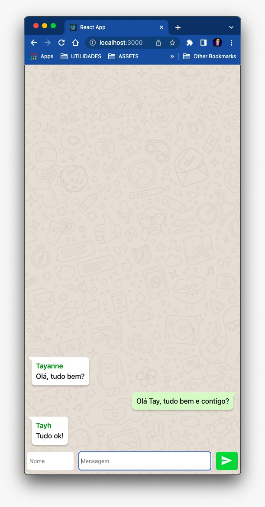

# Whatslab

Aplicação que simula a troca de mensagens entre usuários.

## Sobre

Este é o primeiro projeto de fixação do módulo de React.js da [Labenu](https://www.labenu.com.br/).

## Implementação

O projeto possui as seguintes funcionalidades:

-  Ao enviar a mensagem com o nome de usuário 'Eu' a posiçao da mensagem é invertida, similar a plataforma whatsapp;
-  Envio de mensagens com a tecla 'Enter';
-  Deletar a mensagem com 2 clicks na mesma;
-  A mensagem só é enviada se possuir o nome do remetente e a mensagem.

## Futuras implementações:

-  Avisos sobre o envio com a tecla Enter e a deleção com dois clicks do mouse.

## Bibliotecas utilizadas

-  Stylesd Components
-  React Icons

## Créditos

-  Lucas Duarte, ex-aluno da Labenu, por disponibilizar um artigo-tutorial com algumas das funcionalidades e melhorias de design que foram implementadas nesse projeto.
